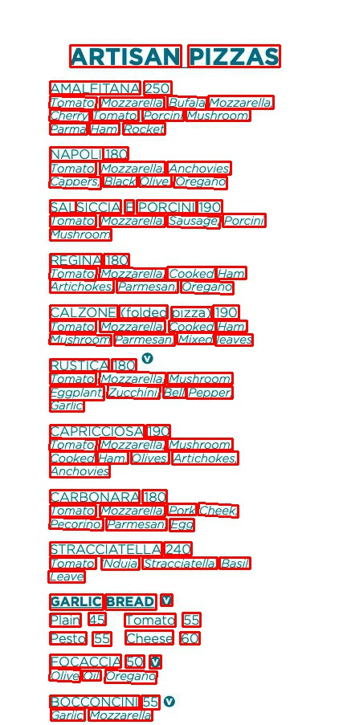
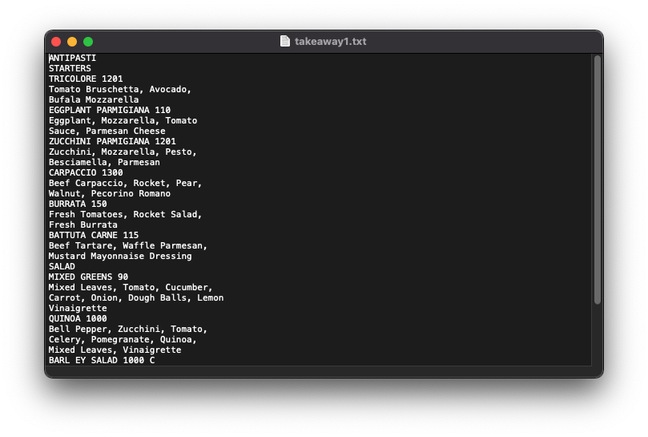
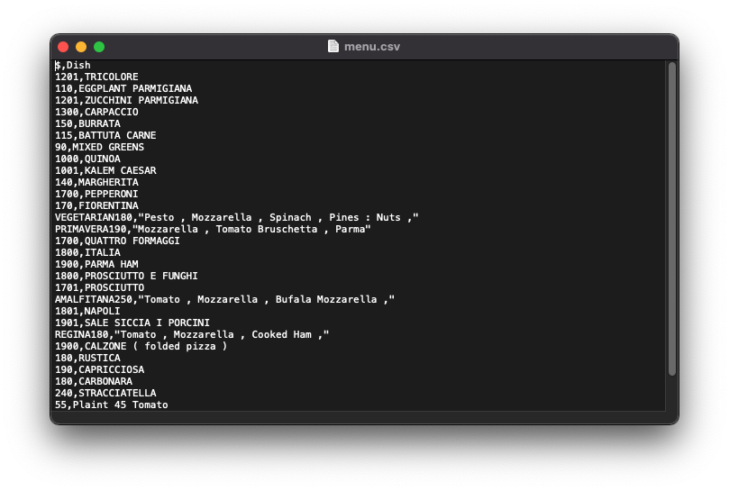

# DigiDoc
<h1 align="center">
  <br>
  
</h1>
<h4 align="center">Helper for transforming your hardcopy document to softcopy!</h4>

DigiDoc is a one-stop text digitization solution for businesses which can convert documents, invoices or other physical text into an organised tabular format using combined machine learning models. 

It helps to simplify the data entry process and reduce manual workload, thereby improving business costs and efficiency. 
Users simply input an image of the document and through our web application, can transform and download it as a txt or csv file. 

Our first step towards DigiDoc is to digitize restaurant menus smoothly for restaurant owners and online food delivery services. 
And then slowly transition towards other physical docucments such as contracts and application forms. We've deployed our model onto Streamlit, try us out!

# Demo Preview


This gif shows a quick demo for our project
1. Drap and drop images to DigiDoc
2. The uploaded images are shown
3. Choose output file format (default is csv)
4. Click 'Run Model' button
5. Preview of the output files are shown
6. Download the output file with links provided

Remarks: DigiDoc is targeting image menu at this moment. 
With more data and further development, it will supoort for other document in images such as invoice, business forms, financial report, etc.

# Table of contents
<!--ts-->
   * [DigiDoc](#DigiDoc)
   * [Demo Preview](#Demo-Preview)
   * [Table of contents](#table-of-contents)
   * [Prerequisite](#prerequisite)
   * [Project Structure](#project-structure)
      * [CRAFT](#craft)
      * [Text Recognizer](#test-recognizer)
      * [Sequential Writer](#sequential)
      * [CSV Converter](#csv-converter)
      * [Web Application](#web-application)
   * [Development](#development)
      * [Data Collection](#data-collection)
      * [Training & Evaluation](#training-&-evaluation)

   * [Deployment](#deployment)
   * [Result](#result)
      * [Performance](#preformance)
      * [Challenge](#challenge)
      * [Improvement](#improvement)
   * [Reference](#reference)
   * [Licensing](#licensing)
<!--te-->

# Prerequisite

1. Git clone this project

      ```git clone https://github.com/heodi510/DigiDoc.git```
      
2. Install packages indicated inside requirements.txt

      ```pip install requirements.txt```

3. Create data folders as below
      ```
      DigiDoc
      └──data
        ├── craft_output
        ├── crop_img
        ├── input_img
        └── output
      ```
4. Download pretrained model from clovaai/CRAFT-pytorch

    *Resource* | *Location* | *Link* 
    ------------- |--------- |---------
    **CRAFT-Pytorch Repository** | -- | [Click](https://github.com/clovaai/CRAFT-pytorch)
    **CRAFT for General Purpose** | CRAFT/weights | [Click](https://drive.google.com/open?id=1Jk4eGD7crsqCCg9C9VjCLkMN3ze8kutZ)
    **TextRcognizer** | TextRecognizer/weights |[click](https://drive.google.com/file/d/1Z9cof1b6F-GONooOesPE2vQC-YzjvAY3/view?usp=sharing)
    
# Project Structure

The basic structure of DigiDoc is a pipeline of modules. Each module perform a different function on user input and process the input to next module.
Here is the pipline of modeule:


[**CRAFT**](https://github.com/clovaai/CRAFT-pytorch) [1]

The CRAFT model is a VGG16 based model which calculate the similiarity of text and group the characters as a word. 
For each grouped characters, the model will draw a smallest rectangle and bound the whole word. 
Once we have the rectangular boundary, we found out 4 vertexs of the rectangle and cropped it with openCV library. 
The cropped images are passed to text recognizer.

Exmaple:\


**Text Recognizer**

The text recognizer is a compounded model containing 4 modules as show above.
The TPS module is for transform the input and make it more likely as a proper image with normal angle.
The ResNet Feature Extractor is a ResNet based model without the toppest classification layers.
It is responsible for founding the image features of text image and return the feature vectors with multiple dimensions.
The BiLSTM and Attention layer is to predict the next character. 
With the help the image features of the word, the model can give a high performance prediction of the word based on both computer vision and NLP approach.

**Sequential Writer**

The sequential writer is a function which order all the prediction from text recognizer correctly and write it as text or csv file.
For every single word, the coordinates of bottom vertices are used to calculate a 'vertical level' and seperate each words in different line.
The x coordinate of bottom vertices are used to sorted the word in each line with correct order. Each line with sorted words is combined to single text file
and it is ready to export to user or pass to NER model for generating csv file.

Sample ouput:\


**NER**

The NER model is trained using NLTK. 
With tag of POS and finding out the location of dollar sign, we classifiy the information in text file as a price or a dish discription. 
Finally export the data in csv format.  



# Development

Since the project is built within less than a month, the procedure involved is based on simple machine learning life cycle.
It is not designed to support CI/CD and online training as business case nowadays.

**Data Collection**

Two different kinds of data is collected. One is image data for text recognization and the other one is New York Dataset for menu image

For text recognization:\
training dataset: [Synthetic Word Dataset](https://www.robots.ox.ac.uk/~vgg/data/text/)[2], [Focused Scene Text](https://rrc.cvc.uab.es/?ch=2)[3]\
validation dataset: [Incidental Scene Text](https://rrc.cvc.uab.es/?ch=4)[4], [IIIT 5K](http://cvit.iiit.ac.in/projects/SceneTextUnderstanding/IIIT5K.html)[5]\
test dataset: [Incidental Scene Text](https://rrc.cvc.uab.es/?ch=4)[4], [IIIT 5K](http://cvit.iiit.ac.in/projects/SceneTextUnderstanding/IIIT5K.html)[5], [The Street View Text Dataset](http://www.iapr-tc11.org/mediawiki/index.php/The_Street_View_Text_Dataset)[6]

For NER:\
[Menu data for New York Public Library](http://menus.nypl.org/menus)

**Training & Evaluation**

Hardware config:\
Machine typen: 1-standard-8 (8 vCPUs, 30 GB memory)\
GPUs: 1 x NVIDIA Tesla V100

Training Time:\
Around 22.6 hrs

Evaluation Metrics for text recognization:\
Categorical Cross Entropy (Loss function)\
Accuracy, Normalised Edit Distance 

# Deployment

**Steamlit**\
Framework of web application

**Google App Engine**\
GCP tool for deployment\
The files responsible for deploying the project on GCP app engine are 

# Result
**Performance**
1. Good performance on text prediction since the training data has tons of scene text.
2. Higher error on numbers as training data contain less image of arabic numbers comparing to scene text image.
image_of_number_error
3. The text generated by sequential writer is not well contructed due to different styles of menu.
Sometimes it is difficult for the sequential writer to distinguish which word belongs to which sentence. 
4. Poor performance on generating csv if the content in text file is not well structured
5. Do not support multiple users simultaneously as we didn't design complicated backend to handle different session or threads for each single users.

**Possible Improvement**
1. Create new dataset using the cropped image of price from CRAFT. So we can include more image of arabic numbers in both training set and validation set.
2. Try to build models to recognize the style and information on the image. 
As there are too many styles of menu design in this world, it is better to use machine learning approach instead of programming approach. 
It will be too complicated for handling all conditions.
3. Try to train a NER using the New York Public library for classifying entity with more accuracy result in generating csv.

# Reference

[1] 2019-present NAVER Corp
[2] M. Jaderberg, K. Simonyan, A. Vedaldi, and A. Zisserman. Synthetic data and artificial neural networks for natural scenetext recognition. In Workshop on Deep Learning, NIPS, 2014.\
[3] A. Gupta, A. Vedaldi, and A. Zisserman. Synthetic data fortext localisation in natural images. In CVPR, 2016.\
[4] D. Karatzas, L. Gomez-Bigorda, A. Nicolaou, S. Ghosh, A. Bagdanov, M. Iwamura, J. Matas, L. Neumann, V. R.Chandrasekhar, S. Lu, et al. ICDAR 2015 competition on ro-bust reading. In ICDAR, pages 1156–1160, 2015.\
[5] A. Mishra, K. Alahari, and C. Jawahar. Scene text recognition using higher order language priors. In BMVC, 2012.\
[6] K. Wang, B. Babenko, and S. Belongie. End-to-end scenetext recognition. In ICCV, pages 1457–1464, 2011. 
