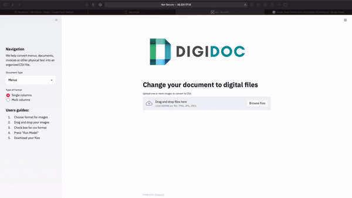

# DigiDoc
<h1 align="center">
  <br>
  
</h1>
<h4 align="center">Helper for transforming your hardcopy document to softcopy!</h4>

DigiDoc is a one-stop text digitization solution for businesses which can convert documents, invoices or other physical text into an organised tabular format using combined machine learning models. 

It helps simplify the data entry process and reduce manual workload, thereby improving business costs and efficiency. 
Users simply input an image of the document and through our web application, can transform and download it as a txt or csv file. 

Our first step towards DigiDoc is to digitize restaurant menus smoothly for restaurant owners and online food delivery services. 
And then slowly transition towards other physical docucments such as contracts and application forms. We've deployed our model onto Streamlit, try us out!

# Demo Preview


This gif shows a quick demo for our project
1. Drap and drop images to DigiDoc
2. The uploaded images are shown
3. Choose output file format (default is csv)
4. Click 'Run Model' button
5. Preview of the output files are shown
6. Download the output file with links provided

# Table of contents
<!--ts-->
   * [DigiDoc](#DigiDoc)
   * [Demo Preview](#Demo-Preview)
   * [Table of contents](#table-of-contents)
   * [Prerequisite](#prerequisite)
   * [Project Structure](#project-structure)
      * [CRAFT](#craft)
      * [Text Recognizer](#test-recognizer)
      * [Sequential Writer](#sequential)
      * [CSV Converter](#csv-converter)
      * [Web Application](#web-application)
   * [Development](#development)
      * [Data Collection](#data-collection)
      * [Preprocessing](#preprocessing)
      * [Training](#training)
      * [Evaluation](#evaluation)
   * [Deployment](#deployment)
   * [Result](#result)
      * [Performance](#preformance)
      * [Challenge](#challenge)
      * [Improvement](#improvement)
   * [Reference](#reference)
   * [Licensing](#licensing)
<!--te-->

# Prerequisite

1. Git clone this project

      ```git clone https://github.com/heodi510/DigiDoc.git```
      
1. Install packages indicated inside requirements.txt

      ```pip install requirements.txt```

2. Create data folders as below
      ```
      data
      ├── craft_output
      ├── crop_img
      ├── input_img
      └── output
      ```
3. Download pretrained model from clovaai/CRAFT-pytorch

    *Resource* | *Location* | *Link* 
    ------------- |:---------: |:---------:
    **CRAFT-Pytorch Repository** | -- | [Click](https://github.com/clovaai/CRAFT-pytorch)
    **CRAFT for General Purpose** | CRAFT/weights | [Click](https://drive.google.com/open?id=1Jk4eGD7crsqCCg9C9VjCLkMN3ze8kutZ)
    **TextRcognizer** | TextRecognizer/weights |[click](https://drive.google.com/file/d/1Z9cof1b6F-GONooOesPE2vQC-YzjvAY3/view?usp=sharing)
    
# Project Structure

The basic structure of DigiDoc is a pipeline of modules. Each module perform a different function on user input and process the input to next module.
Here is the pipline of modeule:


**CRAFT**

The CRAFT model is a VGG16 based model which calculate the similiarity of text and group the characters as a word. 
For each grouped characters, the model will draw a smallest rectangle and bound the whole word. 
Once we have the rectangular boundary, we found out 4 vertexs of the rectangle and cropped it with openCV library. 
The cropped images are passed to text recognizer.

**Text Recognizer**

The text recognizer is a compounded model containing 4 modules as show above.
The TPS module is for transform the input and make it more likely as a proper image with normal angle.
The ResNet Feature Extractor is a ResNet based model without the toppest classification layers.
It is responsible for founding the image features of text image and return the feature vectors with multiple dimensions.
The BiLSTM and Attention layer is to predict the next character. 
With the help the image features of the word, the model can give a high performance prediction of the word based on both computer vision and NLP approach.

**Sequential Writer**

The sequential writer is a function which order all the prediction from text recognizer correctly and write it as text or csv file.
For every single word, the coordinates of bottom vertices are used to calculate a 'vertical level' and seperate each words in different line.
The x coordinate of bottom vertices are used to sorted the word in each line with correct order. Each line with sorted words is combined to single text file
and it is ready to export to user or pass to NER model for generating csv file.

**NER**

The NER model is trained using NLTK. 
With tag of POS and finding out the location of dollar sign, we classifiy the information in text file as a price or a dish discription. 
Finally export the data in csv format.  

# Development

This part we will talking about the procedures involved in machine learning development cycle.

**Data Collection**

**Preprocessing**

**Training**

**Evaluation**


# Deployment

**Steamlit**

**Google App Engine**

# Result

**Performance**

**Challenge**

**Possible Improvement**

# Reference

# Licensing
